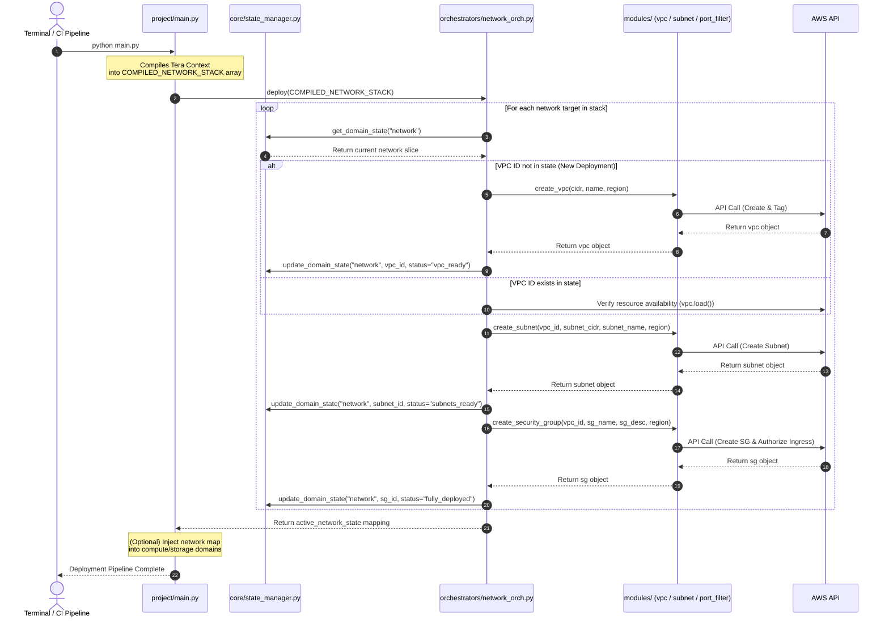

# Rescile Project

This repository provides a blueprint for domain-driven, multi-tier infrastructure provisioning processes using Rescile's UCS. This is useful for hybrid cloud services with infrastructure growing beyond a few VPCs and including compute (EC2, EKS) and storage (S3, EFS) resources. The blueprint structures projects into common domain groups, like network, compute and storage, and decouples the state engine from the deployment code to collect the state from a cloud controller rather thean relying on a build-in state that usually causes drift. Python is used as a generic runtime to rely on provider SDK or the pulumi operator.

## Directory Structure

The project layout reflects common operational domain

```text
aws_network_hub/
├── project/
│   ├── main.py                  # Global Entry Point (Coordinates Group Orchestrators)
│   │
│   ├── core/
│   │   └── state_manager.py     # Pure State Engine (Agnostic of AWS logic)
│   │
│   ├── orchestrators/           # Tier 1: Domain Controllers
│   │   ├── network_orch.py      # Sequences VPC -> Subnet -> Security Group
│   │   ├── storage_orch.py      # Sequences S3 Buckets -> KMS Keys -> IAM
│   │   └── compute_orch.py      # Sequences Keypairs -> EC2 Instances / ASGs
│   │
│   └── modules/                 # Tier 2: Atomic AWS Resource Builders
│       ├── vpc_builder.py
│       ├── subnet_builder.py
│       ├── port_filter.py
│       └── s3_builder.py

```

## Process Sequence

The directory structure enforces a layout where responsibilities are separated into predictable layers.



### 1. Entry Point

The `main.py` file represents the macro-level blueprint and handles top-level command-line flags, like `--delete`. It loads the state, calls `network_orch.deploy()`, grabs the resulting IDs, and feeds them into `compute_orch.deploy()` and coordinates the global reverse teardown (Compute $\rightarrow$ Storage $\rightarrow$ Network).

### 2. Domain Controllers 

Each domain file in the `orchestrators/` directory (e.g., `network_orch.py`) acts as the expert conductor for its specific silo. Domain controllers parse the domain-specific blocks from TOML templates and capture the tight intra-domain dependency sequencing (e.g., it calls `vpc_builder`, waits for the ID, then immediately feeds that ID into `subnet_builder` and `port_filter`). A controller returns a clean structured payload back to `main.py` and should remain provider independent.

### 3. Resource Modules

Modules remain small, generic, and hyper-focused python files. They are completely dumb to the overall business layout. A module like the `vpc_builder.py` just knows how to create or delete a VPC given a CIDR and a region. It doesn't know or care that a compute orchestrator is waiting down the line. Modules are usually defined cloud provider specific to reflect specific dependencies and requirements.

### 4. State Management

By isolating the state manager into a dedicated file in a `core/` folder, it becomes a utility that any layer can call. It reads/writes the `infra_state.json` matrix cleanly, tracking structural keys for each group (`state["network"]`, `state["storage"]`).

## Advantages of this Layout

* **Blast Radius Control:** If something breaks while tweaking an EC2 configuration in `compute_orch.py`, core networking components and templates are completely safe and untouched.
* **Clean Code Collaboration:** Different team members can work on the storage modules and compute workflows simultaneously without causing constant Git merge conflicts in a single orchestration file.
* **Dynamic Dependency Injection:** `main.py` can capture the output of your storage orchestrator (like an S3 bucket ARN) and inject it straight into the compute orchestrator as an environment variable for an EC2 user-data script.

## Check before running

1. Make sure a empty `__init__.py` file exist inside both, the `modules/` and `orchestrators/` directories. This ensures Python treats them as valid packages so that the `import` statements work seamlessly.
2. Make sure the import statement reads `from orchestrators import network_orch` in the `main.py`.
3. The execution workflow remains as simple: `python main.py` or `python main.py --delete`, while the code is modular and ready to scale.
