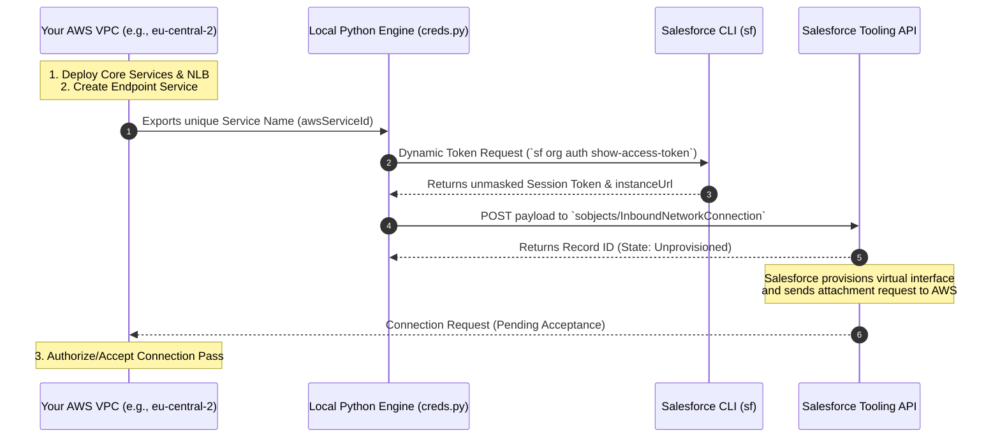

# Salesforce Private Connect

This is developer-first tooling repository designed to programmatically provision and manage Salesforce Private Connect (AWS PrivateLink) infrastructure. The python program bridges the gap between your cloud-native infrastructure (AWS) and the Salesforce control plane, utilizing deterministic toolchains and dynamic token exchanges to enforce clean, zero-trust credential hygiene.

## Dependencies

The development and execution environment uses nix to ensure the codebase is strictly pinned for reproducibility, discarding global system mutations in favor of declarative workspaces.

### The `nix flake` Environment 
The local runtime—including the correct versions of `python3`, `sf` (Salesforce CLI), and specialized terminal utilities (`jq`, `yazi`, `helix`)—is managed deterministically via the project's *Nix Flake*. To launch into the reproducible shell matrix, simply execute:

```sh
nix develop
# Or if using direnv + nix-direnv automatically upon entering the directory:
direnv allow
```

### Upstream `simple-salesforce` Core

Instead of dealing with legacy SOAP envelopes or building fragile raw HTTP wrappers, this engine is powered by `simple-salesforce`. The script initializes the client pinned to modern API versions (`61.0+`) and explicitly taps into the Tooling API sub-space via `sf.toolingexecute()` to handle architectural metadata blocks.

## Provisioning Flow

An Inbound Network Connection cannot be initialized blindly; it is a cross-vendor handshake. The AWS VPC infrastructure must exist before Salesforce can request a connection interface.



## Prerequisites

Before running the orchestration scripts, you must acquire an active session token from your targeted Salesforce organization without hardcoding secrets into the source tree.

1. Authenticate the Salesforce CLI against your designated sandbox or scratch org:

```sh
sf org login web --alias dev-org
```
*Note: Ensure your alias target matches the expected environment variables or configuration blocks.*

2. Seed Your Working Shell Environment by extracting the dynamic session attributes directly from your local authenticated CLI profile:

```sh
export SF_INSTANCE_URL=$(sf org display --target-org dev-org --json | jq -r '.result.instanceUrl')
export SF_ACCESS_TOKEN=$(sf org auth show-access-token --target-org dev-org --json | jq -r '.result.accessToken')
```

3. Obtain the AWS Service ID and ensure that the backend Network Load Balancer (NLB) and VPC Endpoint Service are live in AWS. Copy the global service name from your AWS configuration parameters: `com.amazonaws.vpce.<region>.vpce-svc-<unique-hash>`

## Execution

Once the environment variables are populated, update your execution configuration payload block with your active `awsServiceId`. Run the provisioning lifecycle pass:

```sh
python create_private_connect.py
```

### Execution Logic

1. **Validation:** The script asserts the presence of `SF_INSTANCE_URL` and `SF_ACCESS_TOKEN`, failing fast if the workspace is unseeded.
2. **Client Bootstrapping:** Instantiates a secure `Salesforce` context mapped to the modern REST/Tooling namespaces.
3. **Staging:** Ships a specialized metadata payload targeting `sobjects/InboundNetworkConnection`.

## Next Steps

Once the script outputs a successful JSON receipt (`Success Status: True` along with a Salesforce Record ID), the link is staged but not active. To finalize the handshake:

* **Accept the Connection in AWS** Navigate back to the AWS Console -> VPC -> Endpoint Services -> Endpoint Connections. You will see a new incoming request originating from the Salesforce infrastructure account. Select it and click "Accept Endpoint Connection Request".
* **Verify Setup Status** Log into the Salesforce Org UI. Navigate to Setup -> Private Connect. Your inbound connection status will transition from `Unprovisioned` or `Pending` to `Ready` as soon as the routing fabrics sync.
* **Bind named credentials** You can now define Apex callouts, external services, or secure ingestions routing through this verified internal pipeline, bypassing the public internet completely.
